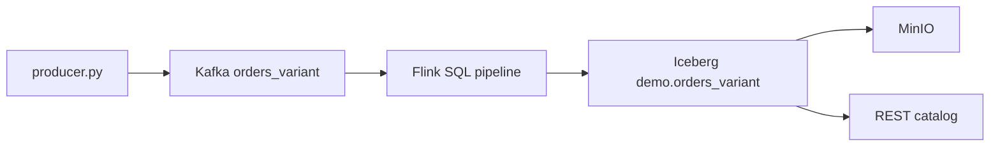

# Flink SQL — Kafka to Iceberg V3 (VARIANT)

Local demo: **Kafka JSON → Flink SQL → Iceberg V3** with all order columns as `STRING` and **`event_variant` as native `VARIANT`**.

No Java job, no Dynamic Iceberg Sink — only Flink SQL.

## Architecture



## Quick start

```bash
docker compose up -d --build
chmod +x scripts/pipeline.sh

./scripts/pipeline.sh run          # register + start pipeline + sample data
python3 simple_fanout_test.py      # query VARIANT in Spark
```

## Pipeline commands

| Command | What it does |
|---------|----------------|
| `./scripts/pipeline.sh register` | Create Iceberg `demo` namespace + Kafka topic |
| `./scripts/pipeline.sh start` | Submit Flink SQL job (fresh — drops table) |
| `./scripts/pipeline.sh start --keep` | Submit job, keep existing Iceberg table |
| `./scripts/pipeline.sh pause` | Cancel job; keep table + Kafka offsets |
| `./scripts/pipeline.sh stop` | Cancel job + drop Iceberg table |
| `./scripts/pipeline.sh run` | `register` + `start` + produce 20 messages |

```bash
# typical flow
./scripts/pipeline.sh register
./scripts/pipeline.sh start
docker exec python python /workspace/producer.py

# pause and resume
./scripts/pipeline.sh pause
./scripts/pipeline.sh start --keep

# full shutdown
./scripts/pipeline.sh stop
```

## Services

| Service | URL |
|---------|-----|
| Flink UI | http://localhost:8081 |
| Kafka UI | http://localhost:9080 |
| Iceberg REST | http://localhost:8181 |
| MinIO Console | http://localhost:9001 (`admin` / `password`) |

## Kafka message shape

```json
{
  "order_id": "...",
  "site_id": "siteA",
  "product_name": "widget",
  "order_value": "255",
  "priority": "LOW",
  "order_date": "2026-05-13",
  "ts": "1779718231.163624",
  "event_variant": {
    "schema_version": 1,
    "kind": "order",
    "user": { "id": "...", "labels": ["..."], "prefs": { "theme": "light" } },
    "line_items": [{ "sku": "AP-191", "qty": 1, "unit_price": "76.41" }],
    "scores": { "k0": 67, "k1": 78 },
    "at": "2026-05-25T14:10:31",
    "note": "..."
  }
}
```

## Iceberg sink schema (V3)

| Column | Type |
|--------|------|
| `order_id`, `site_id`, `product_name`, … | `string` |
| `event_variant` | **`variant`** |
| `variant_kind`, `variant_user_id`, … | `string` / `int` — nested paths extracted at ingest |

Flink 2.1 cannot query nested paths from a stored `VARIANT` column on read. The pipeline extracts common nested fields into `variant_*` columns using `JSON_VALUE` on the Kafka JSON string.

## Key files

| File | Purpose |
|------|---------|
| `sql/kafka-iceberg-variant/pipeline.sql` | Streaming Flink SQL job |
| `sql/kafka-iceberg-variant/check-variant-shredding.sql` | DuckDB SQL for VARIANT shredding inspection |
| `scripts/check-variant-shredding.sh` | Run DuckDB shredding check against MinIO Parquet |
| `scripts/pipeline.sh` | `register` / `start` / `pause` / `stop` / `run` |
| `producer.py` | Sample Kafka producer |
| `simple_fanout_test.py` | Local PySpark — query Iceberg VARIANT via REST + MinIO |
| `Dockerfile` | Flink 2.1 + Iceberg + Kafka connector |

## Query VARIANT with local Spark

Spark 4.1 can read nested paths from stored `VARIANT` using `variant_get` (Flink 2.1 cannot).

```bash
# stack + data must be running first
python3 simple_fanout_test.py
```

Example SQL (also in `simple_fanout_test.py`):

```sql
SELECT
  order_id,
  site_id,
  variant_get(event_variant, '$.kind', 'string') AS kind,
  variant_get(event_variant, '$.user.id', 'string') AS user_id,
  variant_get(event_variant, '$.user.prefs.theme', 'string') AS theme,
  variant_get(event_variant, '$.scores.k0', 'int') AS score_k0,
  variant_get(event_variant, '$.line_items[0].sku', 'string') AS first_sku,
  try_variant_get(event_variant, '$.note', 'string') AS note
FROM iceberg_rest.demo.orders_variant
ORDER BY order_id
LIMIT 10;
```

MinIO / REST settings (defaults match `docker-compose.yml`):

| Env var | Default |
|---------|---------|
| `MINIO_ENDPOINT` | `http://localhost:9000` |
| `MINIO_ACCESS_KEY` | `admin` |
| `MINIO_SECRET_KEY` | `password` |
| `ICEBERG_REST_URI` | `http://localhost:8181` |
| `ICEBERG_WAREHOUSE` | `s3://warehouse/` |

Requires two Maven packages (MinIO S3 + Iceberg REST):

```bash
export PACKAGES="org.apache.iceberg:iceberg-spark-runtime-4.0_2.13:1.11.0,org.apache.iceberg:iceberg-aws-bundle:1.11.0"
python3 simple_fanout_test.py
```

## Check VARIANT shredding (DuckDB + MinIO)

Flink writes **unshredded** VARIANT in Parquet (`event_variant.value` + `event_variant.metadata` blobs).  
Spark can opt into **shredding** (`typed_value.*` subcolumns); this Flink pipeline does not.

```bash
./scripts/check-variant-shredding.sh
```

Or manually with DuckDB:

```bash
FILE="s3://warehouse/demo/orders_variant/data/00000-0-....parquet"

duckdb -cmd "INSTALL httpfs; LOAD httpfs;" \
  -cmd "SET s3_endpoint='localhost:9000'; SET s3_access_key_id='admin'; SET s3_secret_access_key='password'; SET s3_use_ssl=false; SET s3_url_style='path';" \
  -c "
SELECT
  path_in_schema AS column,
  num_values AS rows,
  stats_null_count AS nulls,
  CASE WHEN stats_null_count = num_values
       THEN 'FULLY SHREDDED ✓'
       ELSE 'NOT SHREDDED ✗'
  END AS status
FROM parquet_metadata('$FILE')
WHERE path_in_schema = 'event_variant, value';
"
```

Expected for this Flink pipeline: **`NOT SHREDDED ✗`** — `event_variant, value` has data (nulls = 0), no `typed_value` columns.

## Fresh re-run

```bash
./scripts/pipeline.sh stop
./scripts/pipeline.sh start
docker exec python python /workspace/producer.py
python3 simple_fanout_test.py
```

## Cleanup

```bash
docker compose down -v
```
